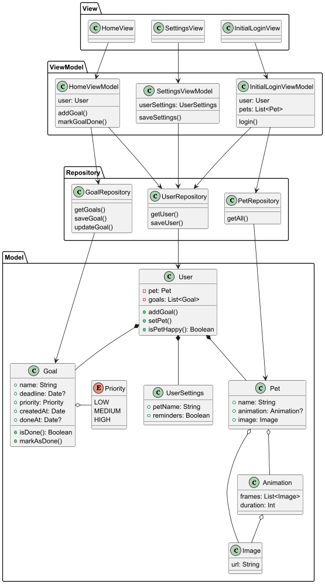

# HabitHatch

was wir entwickeln?!
Beim Start Auswahl von Tier, 4 werden angezeigt, aber nur 1 kann ausgewählt werden
Activity Wechsel von Start zu Home
Tabelle/Liste an Zielen
Tabelle sortieren nach erledigt und Deadline oder Prio
Ziel hinzufügen
Ziel als erledigt markieren
Ziel mit Sprachsteuerung einfügen
Animation von einem Tier anzeigen, indem ein Video angezeigt wird; Besteht aus 4 wechselnden Frames
Wenn alle Ziele erledigt ist Tier glücklich, das Video bekommt einen hellen Farb filter
Wenn nicht alle Ziele erledigt dunkler Farbfilter, Tier ist unglücklich
User Settings anzeigen

## Tech Stack
- **Kotlin Version**: 2.1.0
- **Min Android SDK**: 34

### Jetpack Compose:
- material3: version 1.3.2

### Room Database:

### Unit Testing:
- junit: 4.13.2
- truth: 1.1.6`

### Android Testing:
- androidx.test.ext:junit: 1.2.1
- espresso-core: 3.6.1
- compose.ui:ui-test-junit4: 1.7.6

## Architecture:

## Activities / Navigation
Android recommend only using one Activity, to use Jetpack Navigation instead.
https://developer.android.com/topic/architecture/recommendations

